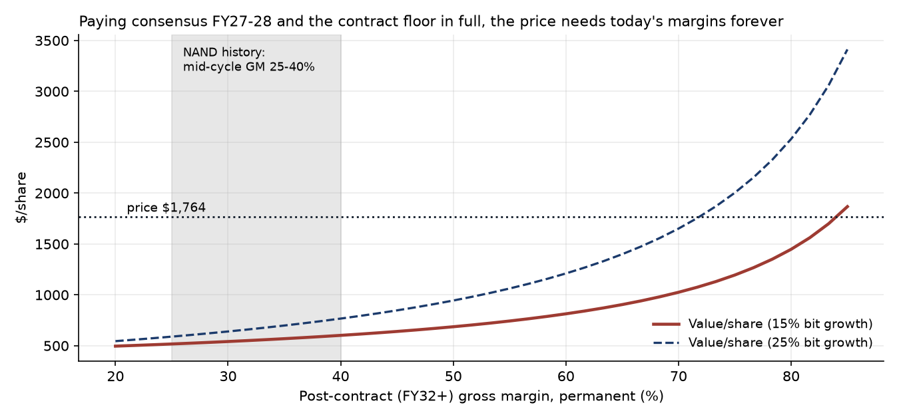

# The SanDisk Short — Full Case & Deck Plan (v2)

**Oxford Alpha Fund · Varsity Pitch Competition 2026 · Rebuilt after the 9 Sep 2026 red team** ([REDTEAM_2026-09-09.md](REDTEAM_2026-09-09.md))

| | |
|---|---|
| Recommendation | **SHORT SanDisk (NASDAQ: SNDK)** |
| Price at analysis | **$1,764** (9 Sep 2026) · market cap $258bn · EV $254bn · joins S&P 100 on 21 Sep |
| 12-month base target | **$930 (−47%)** · scenario range $630–$2,260 |
| Expected short return | **+28%** probability-weighted (50/20/30) · reward/risk **4.3 : 1** |
| Intrinsic value | Contract-aware DCF median **$663**; today's price sits at the **97th percentile** of our value distribution |
| Engine | `analysis/sndk_contract_dcf.py` is the single source for every headline number · 17/17 tests passing |

**The one-liner:** *The market has capitalised a five-year contract as a perpetuity. Pay the Street's boom in full for the entire life of SanDisk's contracts, and today's price still needs $17bn of profit a year, forever, from a business whose best year before 2026 earned $1.6bn.*

**Why a PM acts on it:** the bet is not "memory is cyclical" (everyone knows that, and the 8× forward P/E shows the market knows it). The bet is that the *terminal value* — 70%+ of the enterprise value — assumes SanDisk's post-2031 economics are better than the contracted floor of the best cycle in NAND history. That claim is falsifiable on a dated calendar, and the first three tests (Micron 30 Sep, TrendForce 4Q26 print early Oct, hyperscaler capex late Oct) land before or around the final.

---

## 1. What the red team changed (2 Sep → 9 Sep)

The idea survived; the case as written on 2 Sep did not. Full memo: [REDTEAM_2026-09-09.md](REDTEAM_2026-09-09.md). The five corrections that matter:

1. **The headline was wrong.** "34× the best year this business ever had" used FY25 ($0.51bn, year one after the spin, after a $1.8bn impairment). Standalone SanDisk earned **$1.56bn operating income in FY2014**. The correct multiple was ~11×, and no script produced the $17.4bn either way. The headline is now derived from one engine, and it no longer depends on picking a base year.
2. **The contract book was ignored.** SanDisk has 10 long-term "New Business Model" (NBM) agreements with 8 customers: **$93.9bn of minimum revenue at floor pricing, weighted duration over 4 years, ~80% gross margin at floor, $16.5bn of customer guarantees**, covering >50% of FY27 bits and ~2/3 of FY28 bits. This is the market's evidence of permanence. It is now the spine of the pitch, not a footnote.
3. **The model under-paid the boom.** The old "62% boom margin" was *below* consensus (FY27/28 consensus net margins are ~64%/67%; FQ1 gross-margin guide is 83–85%). Every scenario now pays FY27–28 at consensus and FY29–31 at the contract floor in full.
4. **The catalysts were mis-dated.** Micron reports **30 Sep**, not 22–24 Sep; SNDK reports **6 Nov**; the LTA disclosure the old deck "waited for in November" was made on 5 Aug. A kill criterion (LTA coverage >70%) was already met. All replaced.
5. **The differentiator was oversold.** The option-implied density sits within ~5 points of a flat lognormal at 76% IV and its tail probabilities moved 15 points in a week of data. It is now a sizing and "what's priced" tool, not "market dissent."

## 2. The situation in six numbers (all refreshed 9 Sep 2026)

1. **$237 → $2,354 → $1,258 → $1,764.** 2026 open, June high, August post-earnings low, today. −25% from the high; +40% from the low in five weeks on MSCI (31 Aug) and S&P 100 (announced 4 Sep, effective 21 Sep) inclusion flows. 128 hedge funds held $25.6bn at Q2, up from 114; Druckenmiller and Tepper exited in Q2. Price-to-book **16.5×**, versus 2.2–3.6× at every prior SanDisk and Micron cycle peak.
2. **Gross margin 7% → 16% → 30% → 71.5%** (FY23–FY26); quarterly **23% → 85%** in five quarters. FQ4 revenue $8.97bn: **two-thirds of the sequential growth was price**. Nothing changed in the technology.
3. **Consensus revenue $20.2bn → $49.0bn → $57.8bn** (FY26→FY28) on **mid-teens sellable bit growth**: the Street's FY27 is +142% revenue on +15% bits. FY28 estimates span $42.6–83.4bn.
4. **$93.9bn of contracted floor revenue over ~4.5 years ≈ $21bn/yr for ~2/3 of bits** — floor pricing applied to all bits is ~$31bn/yr, **46% below FY28 consensus**. The floors are real; they are also well below where the Street is modelling.
5. **Only $2.7bn of the $16.5bn "guarantees" is cash on SanDisk's balance sheet** ($1.24bn contract liabilities + $1.50bn refundable deposits, FY26 10-K); the rest is third-party collateral released toward contract end. SanDisk is obligated to pay **half of Flash Ventures' fixed costs regardless of output**, with $6.6bn of JV commitments FY27–31.
6. **NAND contract prices: +55–60% (1Q26), +70–75% (2Q26), +10–15% (3Q26)**; August monthly benchmark **+1.4%**; spot 512Gb wafer **−2.7% in the week of 7 Sep** with "suppliers lowering quotes." Kioxia's CEO, SanDisk's JV partner, on 8 Sep: *"Prices have already risen enough."* The second derivative turned in July.

## 3. What the market believes — in the bulls' own words

We state the bull case at full strength because the pitch only works if it beats this, not a strawman.

- **Demand changed in kind.** Enterprise SSD went from 26% to 48% of NAND bits in a year; Nvidia's Vera Rubin rack specifies 16TB of NAND per GPU; HDD is sold out into 2028 so SSD demand is incremental, not substitution. Hyperscaler capex ~$775–800bn in 2026, all five signalling higher 2027.
- **Supply is capped to 2028–29.** Samsung (30 Jul): "unlikely to see any significant increase in incremental supply through 2028"; Samsung and SK hynix cut NAND wafer starts to fund HBM; no greenfield NAND fab outputs before 2H28 (Micron Singapore) / FY29 (Kitakami Fab 3); 2026 NAND capex +5% vs DRAM +14%.
- **The contracts change the transmission.** ~2/3 of FY28 bits under floors with $16.5bn of collateral; Micron has $100bn of take-or-pay agreements with $22bn of prepayments; Samsung has 60–70% of capacity under 3-year-plus deals. Management: bits "on allocation beyond calendar 2027."
- **The stock is already priced for a cliff.** 8.2× forward EPS; Citi applies 9× "like a mature cyclical" and still clears spot; Bernstein's stress case ($0.11/GB on uncovered bits) yields FY30 EPS $214, so the price is ~8× a floor-protected trough. Management's FY28–30 model: mid/high-teens revenue growth, ~80% GM, ~75% operating margin, ~50% FCF margin, 100% of excess cash returned; $15.5bn of buyback authorisation remains.

Everything above is true. None of it changes what the price requires **after 2031**. That is the trade.

## 4. The variant view: one spine, three pillars

### The spine — the contracts have an expiry date; the price does not

Pay the Street in full, then pay the contracts in full, then ask what is left. Engine: `analysis/sndk_contract_dcf.py`; chart: `analysis/outputs/priced_in_waterfall.png`.

| What you pay for | PV at 11% | Residual EV | Perpetual NOPAT the residual needs |
|---|---|---|---|
| **A.** Consensus FY27–28 net income ($31.3bn, $38.8bn) | $59.7bn (24% of EV) | $194bn | **$21.1bn/yr from FY29, forever** ($18.3–26.9bn across 10–13% WACC) |
| **B.** Five full peak years FY27–31 — FY28 consensus held flat through the whole contract life ($187bn of net income) | $136.6bn (54% of EV) | $117bn | **$17.4bn/yr from FY32, forever** |
| **C.** Consensus FY27–28 + NBM floor ($18.8bn/yr at 80% GM) for FY29–31, non-contract bits at 40% GM | $77.7bn | $176bn | **$26.2bn/yr from FY32** = a **permanent 84% gross margin** on FY32's cost base |

Read row B slowly: grant management's entire long-term model for five years — 75% operating margins on $58bn of revenue, the best economics any commodity semiconductor business has ever printed — and you have paid for 54% of the enterprise value. The other 46% is a claim on FY2032 onward that needs $17.4bn of after-tax profit every year, indefinitely. Standalone SanDisk's best year (FY2014) earned $1.56bn of operating income. Micron's entire company (DRAM + NAND) earned $9.7bn at the 2022 peak. The **entire NAND industry** — all five producers combined — earned an estimated $17–21bn of operating profit in its best pre-2026 year (2018) and $12–15bn in 2021–22. Goldman's own "normalised" SanDisk EPS ($110) is $16bn of net income — *below* what the price needs as a floor for eternity.

The one-sentence version: **the market is paying a perpetuity multiple on a five-year contract.**

### Pillar 1 — The floors are far below consensus, and the "guarantees" are smaller than they sound

*Market believes:* the NBMs make ~2/3 of the business non-cyclical at ~80% margins.

*We can show:* the company's own floor arithmetic. $93.9bn over ~4.5 years is ~$21bn/yr for ~2/3 of bits → ~$31bn/yr if every bit were at floor, vs FY28 consensus of $57.8bn. Consensus therefore assumes the *uncontracted* third of bits and the variable portion of the contracts stay at 2026 spot economics — the exact prices Kioxia's CEO now says are high enough. Of the $16.5bn of "financial guarantees," $2.7bn is on SanDisk's balance sheet; the remainder is third-party collateral that is *released toward the end of the agreements*. Two of eight NBM customers have already re-opened their contracts (in SanDisk's favour so far — one extended, one added volume). Contracts that can be re-opened up can be re-opened down. Prior-generation memory LTAs (Goldman: "minimal enforceability — buyers could reduce volumes or breach with limited consequences") were never tested at scale; these are untested too. We do **not** claim the floors break; we claim the price already assumes something better than the floors, permanently.

### Pillar 2 — The earnings are price, the price is decelerating, and the supply answer is dated

*Market believes:* "sold out through 2027" means pricing holds through 2027.

*We can show:*
- **Consensus FY27 is +142% revenue on mid-teens bits.** Revenue is price; the FQ4 print was two-thirds price. When price stops rising, the growth stops; when it falls, the operating leverage runs in reverse against a cost base SanDisk cannot cut (half of Flash Ventures' fixed costs are payable regardless of output).
- **The second derivative has turned.** TrendForce quarterly contract growth +55–60% → +70–75% → +10–15%; consumer buyers at "the limit of price tolerance"; wafer demand "weakened so significantly"; client-SSD OEM inventories "elevated" after the H1 pre-build; August benchmark +1.4%; spot wafer flat since June and down in early September with suppliers cutting quotes; retail $/TB flat since February. Morgan Stanley's memory analyst (21 Jul) calls a **4Q26 contract-price peak**. Sell-side EPS-upgrade breadth has fallen from 92% to 77%.
- **Demand destruction is in the numbers.** SanDisk's own Consumer segment fell **32% QoQ** in FQ4 ("some impact on the TAM itself" — CFO). IDC: 2026 smartphones −16.7%, the steepest decline ever recorded, with NAND/DRAM costs up 300%+; PCs −11%. Amazon and Alphabet cite memory cost as a capex driver; Alphabet posted its first negative free cash flow since IPO.
- **The supply response is dated, and it is 2027.** Every dated primary forecast puts the supply/demand crossover in **2H27**: TrendForce (21 and 30 Jul: 2026 deficit 4–5%, balance "turns positive in the latter half of 2027," "increasing downward pressure on prices"); Yole (2027 "may mark the beginning of a down cycle"). The 2027 bits come from density, not fabs: BiCS10 (+59% density) in mass production since July, Samsung V10 (400L) since August, SK hynix 321L to half of Korean capacity by year-end, SK hynix Dalian 2 (30–50k wafers/month through 1H27), YMTC Wuhan Fab 3 pulled into 2H26 with a 500k wpm ambition and 14% bit share already. Then the fabs: ¥5tn ($31bn) Kioxia/SanDisk Japan plan announced 27 Aug, Kitakami Fab 3 output FY2029. The industry is doing what it always does at $500bn of revenue.
- **Base rates.** No NAND up-leg has run much past eight quarters; prices stabilised in 2Q25, so 2Q27 is quarter eight. Peak-to-trough took 19–24 months in 2010–12, 2017–19 and 2021–23, and in 2018 and 2022 the decline began within one quarter of supply crossing demand. Contract wafer prices fell >70% in 2018–19 and 30–35% in a single quarter in 3Q22.

### Pillar 3 — Even the bulls' normalised numbers do not reach the price

*Market believes:* "8× forward is cheap for a company with a contracted floor."

*We can show:* the Street's own through-cycle frameworks only reach today's price with multiples no cyclical has ever sustained.

| Framework | Normalised EPS | Net income | Multiple at $1,764 | Their multiple → target |
|---|---|---|---|---|
| Morgan Stanley through-cycle | $76 | $11.1bn | 23.2× | 23× → $1,748 (≈ price) |
| Goldman normalised | $110 | $16.1bn | 16.0× | 20× → $2,200 |
| Bernstein FY30 floor stress | $214 | $31.3bn | 8.2× | (assumes 60% coverage at $0.29/GB *and* half the shares retired) |
| **What the price needs forever after five peak years** | — | **$17.4bn NOPAT** | — | — |

Morgan Stanley's through-cycle EPS went $30 → $48 → $76 in four months as spot rose: "normalised" is being marked to spot too.

*The historical record* (full table in §5 and appendix A2): across **33 documented pre-boom NAND company-years** (SanDisk 2005–15, Micron's NAND units 2010–24, Kioxia 2018–25), the **median operating margin is 9%**, the mean is 3%, the single best year is 30% (SanDisk 2010, with a near-100%-margin royalty stream), the best three-year run is 24%, and **30% of all years lost money**. Micron's NAND unit never exceeded a 19% operating margin in thirteen disclosed years. The required perpetual NOPAT ($17.4bn) is roughly the *entire industry's* operating profit in its best pre-2026 year.

*The relative-value check* — same fabs, different price: Kioxia (TSE: 285A) co-owns the Flash Ventures fabs SanDisk buys every wafer from, is ~20% larger by revenue, and trades at **3.1× forward sales and 4.4× forward earnings** against SanDisk's **5.2× and 8.2×**. SanDisk at Kioxia's multiples is **$940–1,080 per share** (−39% to −47%). There is no HBM premium to explain the gap (neither makes HBM); there is a listing-venue premium and an index-flow premium. SanDisk's price-to-book of 16.5× compares with 2.2–3.6× at *every* prior SanDisk and Micron cycle peak, each of which was followed by a 40–59% drawdown within 6–12 months.

### Why the mispricing exists

- **The contracts created a new narrative.** "Durable, contracted, non-cyclical" is a story that converts a cyclical into a compounder in a portfolio manager's mind. The narrative is true for four years. The multiple treats it as true forever.
- **Reflexive estimates.** Sell-side FY27–28 numbers are marked to spot; "normalised" numbers are marked to spot; the price is validated by numbers derived from the price.
- **Flow ownership.** MSCI and S&P 100 inclusion after a 30× market-cap increase; 128 hedge funds entered as the two most experienced macro investors in the register exited. Index and pod money owns it because it went up and because it is now in the benchmark.
- **The company is buying its own stock at 24× trailing** — $4.5bn last quarter, $15.5bn authorised — at the top of its own cycle, exactly as Micron did in 2018 and 2022.
- **An 18-month-old listing.** No institutional memory of this asset earning $1.6bn in a good year and losing $2.1bn in a bad one.

## 5. What the models say

One engine, five reads. Charts in [`analysis/outputs/`](../analysis/outputs/).

| Model | Result | Method note |
|---|---|---|
| Contract-aware reverse DCF (A/B/C above) | Pay 2 boom years → **$21.1bn/yr forever**; pay 5 → **$17.4bn/yr**; pay boom + floor → **84% permanent GM** required | Consensus net income paid directly; NBM floor from the FQ4 call; 11% WACC (10–13% shown); 2% terminal growth; 15% guided tax |
| Sum-of-parts intrinsic value | Post-contract GM 30% → **$541** · 40% → **$602** · 50% → $687 · 60% → $814 · 70% → $1,025 · 80% → $1,448 | FY27–28 consensus + FY29–31 NBM floor at 80% GM + non-contract bits at mid-cycle + terminal at mid-cycle; cost base grows with bits (15%) less cost/bit declines (12%) |
| Contract-aware Monte Carlo (20,000 paths) | Median **$663**; p5–p95 $460–$1,463; **P(value > price) = 2.8%**; price at the **97th percentile** | Post-contract GM drawn N(45%, 15%) — *deliberately above* NAND history; bit growth N(18%, 7%); WACC triangular 10–13%; consensus hit/miss ±12%; 20% chance floors renegotiated to 60–90% |
| 12-month scenario targets (§6) | Base **$930** (7× a cut FY28 EPS of $132) · bust $630 · against-us $2,260 (9× consensus FY28) | Multiple × EPS, every input stated |
| Option-implied density (Jan-27, 198 quotes, OI ≥ 50) | ATM IV **76%**; P(> price) 39%; P(> $2,125 target) 23%; P(< $1,000) 15%; 25Δ risk-reversal **+4.2%** (calls rich) | Breeden–Litzenberger, own IVs, vol-space spline, call-spread cross-check within 2 points. **Used for sizing and "what's priced," not as a forecast** — it sits within ~5 points of a flat lognormal |
| Factor regression (vs SMH, Newey–West) | Beta **1.73**, R² **43%**, **79% annualised idiosyncratic vol** | The position is majority idiosyncratic; a full beta hedge would buy back MU, which falls in the payoff state |
| Positioning | Short interest **5.3% of float** (FINRA 14 Aug), ~1 day to cover, borrow **0.28%** (GC), 2.1m shares available | Uncrowded; the risk is flow and momentum, not a squeeze from shorts |

**Base-rate table — what NAND actually earns** (GAAP operating margin; sources in appendix A2: SEC 10-Ks and earnings releases, Kioxia securities reports, StockAnalysis):

| Year | SanDisk standalone | WDC Flash / new SanDisk | Micron NAND unit | Kioxia |
|---|---|---|---|---|
| 2005–07 | 25.0 · 10.0 · 7.1 | | | |
| **2008** | **−58.9** (trough, incl. impairments) | | | |
| 2009–11 | 14.6 · **30.3** (peak) · 27.0 | | 11.4 · 12.6 | |
| 2012–15 | 13.8 · 25.3 · **23.5** (peak, $1.56bn) · 11.1 | | 7.2 · 7.1 | |
| 2016–18 | | | −4 · 12 · **19** (peak) | 9.2 |
| 2019 | | | −10 | **−17.5** |
| 2020–22 | | ~+4 · ~+12 · ~+20 (est.) | 1 · 4 · 11 | n/a · 14.2 · −7.7 |
| **2023** | | **−22.4** (ex-impairment) | **−74** | **−23.5** |
| 2024–25 | | −7.0 · +6.2 (ex-impairment) | −8 | 26.5 · 37.2 |
| **2026** | | **61.2** (FQ4: 78%) | | Q1 FY26: 75 |

Statistics over the 33 pre-boom company-years: **median 9.2%, mean 2.9%, best year 30.3%, best three-year average 24.0% (13.4% for a pure manufacturer), 10 of 33 years negative**. Every producer lost money in at least one of 2008, 2019 and 2023. NAND industry operating profit at the 2018 peak: ~$17–21bn (all producers, estimated); at the 2021–22 peak: ~$12–15bn. SanDisk's FY26 operating income alone ($12.4bn) equals the whole industry's 2021–22 peak.

The price requires a permanent gross margin (84%) above every number in this table except the current quarter, and a perpetual profit equal to the whole industry's best year.

## 6. Valuation, scenarios, and the trade

**Intrinsic value** is the sum-of-parts above: $540–$1,025 across post-contract margins of 30–70%, median $663. **The 12-month target** is what the market pays once the terminal narrative breaks — a multiple on a revised FY28, not the DCF value, because that is how memory stocks have actually traded through rollovers (Micron 4–6× forward through 2018–19; SNDK itself −47% in five weeks this summer on a *guidance* wobble).

| Scenario | Weight | FY28 revenue / op margin | FY28 EPS | Multiple | Target | Short return |
|---|---|---|---|---|---|---|
| **Base — contract prices flat by 1Q27, falling from 2Q27** | 50% | $38bn / 60% (floors cushion) | $132 | 7× | **$930** | **+47%** |
| **Deep bust — bullwhip unwind + China supply; floors partially renegotiated** | 20% | $30bn / 45% | $78 | 8× | $630 | +64% |
| **Against us — prices rise through CY27; FY28 consensus holds** | 30% | $57.8bn / 75% (management's model) | $252 | 9× (Citi) | $2,260 | −28% |

Probability-weighted **+28%**; reward/risk **4.3:1**. The against-us case is weighted at 30% and priced at the top of the sell-side's "mature cyclical" multiple on full consensus; it is not truncated at the median target. Tail beyond it (the June high $2,354, Bernstein's $3,000) is handled by sizing and the stop, not by pretending it cannot happen.

**Trade construction — numbers, not adjectives:**

- **Size:** 79% idiosyncratic vol → about **2.5% of NAV notional per 1% of NAV at risk per quarter**. A 2.5–3% notional short is the full-conviction size for a book that risks 1% on an idea.
- **Entry:** *after* the 21 Sep S&P 100 inclusion print and *after* Micron's 30 Sep print. Both are before the final. Half the position then; the second half on the first TrendForce print showing wafer or client-SSD contract prices flat-to-down (expected early Oct for 4Q26, or late Dec for 1Q27).
- **Borrow:** 0.28% general collateral, 2.1m shares available (IBKR, 9 Sep) — negligible carry. No dividend.
- **Hedge:** hedge **half** the SMH beta (≈ $0.85 long SMH per $1 short). A full hedge buys back Micron and Samsung exposure that falls in the payoff state; no hedge leaves 43% of variance as sector beta. The residual NAND-complex exposure *is* the bet. (The professional expression — short SNDK / long Kioxia, same fabs, same bits, at 3.1× vs 5.2× forward sales — is outside the competition's US/UK mandate, but is the pair we would run; it removes the AI-storage demand risk and isolates the listing/flow premium.)
- **Stop / tail:** a close above the June high (**$2,354**) means the terminal narrative is being re-rated further, not tested — cover half, reassess. We do not buy call protection: a rolled 3-month 25Δ call at 76% IV costs ~5% of notional per quarter, which would consume the entire expected return.
- **Expected path — say it before the judges do:** the 6 Nov print will most likely show 83–85% gross margin and revenue near the top of guidance, and the stock may rally into it. We expect to be **down 10–20% into November**. We hold because the print cannot change the post-2031 arithmetic, and because the datapoints that can (contract-price prints, inventory days, hyperscaler capex framing) arrive on their own calendar.
- **Holding period:** the competition's 6-month minimum is satisfied by construction; the exit window is the first two negative quarterly contract prints, which the base rates put in 2Q–3Q27.

## 7. Event path — what pays inside the window

| When | Event | What we watch / what it does |
|---|---|---|
| **21 Sep 2026** | S&P 100 inclusion effective | The last mechanical bid. Entry begins after it. |
| **30 Sep 2026** | **Micron FQ4 FY26** (before the final) | NAND ASP (Jun–Aug), FQ1 NAND guide, FY27 capex ($; "above mid-$40bn" reported), CY27 supply/demand language. A capex step-up is bearish for pricing later even if the print beats. |
| Late Sep / early Oct | **TrendForce 4Q26 NAND contract forecast** (before the final) | First official 4Q number. Wafer / client SSD flat-or-down = first dated support; eSSD still "upward" is expected and does not refute the thesis. |
| Late Oct | Samsung / SK hynix Q3 calls; hyperscaler Q3 (MSFT, GOOGL, AMZN, META) | 2027 NAND capex; 4Q bit/ASP guides; hyperscaler 2027 capex framing and inventory days (we compute from 10-Qs). |
| **6 Nov 2026** | **SanDisk FQ1 FY27** | NBM count and any re-opened terms; FQ2 gross-margin guide (first sequential decline?); inventory days (already ~178 vs ~135 a year ago); price/volume split; buyback pace vs Flash Ventures cash calls. |
| Mid Nov | Kioxia 2Q FY26 (285A.T) | 2027 bit-growth plan; K2/Fab 7 tool pace; the JV's economics directly. |
| Early Dec | DRAMeXchange November contract; TrendForce 3Q26 supplier ranking | First negative monthly MLC print? |
| Late Dec / early Jan | **TrendForce 1Q27 forecast** | The first quarter a decline could be printed. Kill-criterion checkpoint. |
| Late Jan 2027 | Hyperscaler Q4 — **2027 capex guides**; SanDisk FQ2; Samsung Q4 | Whether 2027 capex accelerates *with storage-specific commitments*. |
| 1H27 | SK hynix Dalian 2 build-out complete; Samsung 286L Xi'an at full output; YMTC Fab 3 ramp; HBF sampling | First tangible wafer adds. |
| 2H27 | Supply/demand crossover (TrendForce, Kioxia, Samsung all date it here) | Exit window. |

## 8. Kill criteria (pre-committed, none already triggered)

1. **TrendForce 1Q27 and 2Q27 prints both show blended NAND contract prices still rising QoQ** → timing wrong; cover half.
2. **Hyperscaler 2027 capex guides (late Jan) accelerate above ~$1tn with storage-specific commitments**, and SanDisk's FQ2 (late Jan) shows inventory days *falling* → demand leg stronger than modelled; cover half.
3. **SanDisk discloses floor prices ≥ 2Q26 ASP with guarantees that step *up* over the contract life, or a new NBM taking coverage above 80% of FY29 bits** → the terminal is being contracted; exit.
4. **Close above $2,354** → re-rating, not testing; cover half.

## 9. The 10-slide deck

Conclusion first, bull case in the bulls' words, variant view quantified, catalysts dated.

| # | Slide | Content | Exhibit |
|---|---|---|---|
| S1 | **Short SanDisk — $1,764** | 12-mo base $930 (−47%), range $630–2,260, EV +28%, R/R 4.3:1. One-liner: "The market has capitalised a five-year contract as a perpetuity." Roadmap of three pillars. | Verdict bar + price path $237 → $2,354 → $1,258 → $1,764 |
| S2 | **What SanDisk is, and what it signed** | NAND pure-play spun from WDC Feb-25; fabs in the Kioxia JV (half of fixed costs regardless of output; $6.6bn commitments); revenue by end-market (datacenter 38% of bits); the 10 NBM agreements: $93.9bn floor, >4 yrs, ~2/3 of bits, 80% GM at floor, $16.5bn guarantees ($2.7bn on balance sheet). | Contract-book table + JV cash-flow diagram |
| S3 | **The bull case, in their words** | Structural demand (eSSD 26%→48% of bits; Vera Rubin 16TB/GPU; HDD sold out); capped supply to 2028; contracts; 8× forward P/E; management's FY28–30 model. "All true." | Quote wall with sources |
| S4 | **What the price forces you to believe** — the signature slide | The A/B/C bridge: pay 2 years → $21bn/yr forever; pay all 5 contract years at peak → **$17.4bn/yr forever from FY32**; pay boom + floor → **84% GM permanently**. vs SanDisk 2014 ($1.56bn), Micron 2022 ($9.7bn), Goldman normalised ($16bn). | `priced_in_waterfall.png` |
| S5 | **Pillar 1 — the floors vs consensus** | $93.9bn ÷ 4.5 yrs ÷ 2/3 coverage → ~$31bn/yr if all bits at floor vs $57.8bn consensus (−46%); guarantee mechanics; two contracts already re-opened; enforceability untested. | Floor-vs-consensus bar + guarantee waterfall |
| S6 | **Pillar 2 — the earnings are price, and price has stopped accelerating** | +142% revenue on +15% bits; contract-price QoQ path +55–60/+70–75/+10–15; August +1.4%; spot down; Kioxia CEO quote; Consumer −32% QoQ; IDC smartphones −16.7%; MS calls 4Q26 peak. | Contract-price second-derivative chart + consumer demand panel |
| S7 | **Pillar 2b — the supply answer is dated: 2H27** | TrendForce/Yole/Kioxia/Samsung all date the crossover; density roadmap (BiCS10 +59%, V10, 321L), Dalian 2, YMTC Fab 3; ¥5tn Japan plan; cycle base-rate table (no up-leg >8 quarters; 19–24 months peak-to-trough; declines within one quarter of crossover). | Capacity timeline + cycle table |
| S8 | **Valuation — distributions, not points** | Centerpiece: contract-aware MC (median $663, price at 97th pct) vs option-implied density; sum-of-parts by post-contract GM; the Street's normalised-EPS table (MS needs 23×); Kioxia parity ($940–1,080); 12-month scenario table. | `centerpiece_mc_vs_market.png` + `value_vs_midcycle_gm.png` |
| S9 | **The trade — how we get paid** | Sizing (2.5% notional per 1% risk), entry after 21 Sep / 30 Sep, half-beta hedge, borrow 0.28%, stop at $2,354, expected path (down into Nov), dated event table with in-window tests. | Catalyst timeline with entry/stop markers |
| S10 | **Risks, kill criteria, asymmetry** | (1) Prices rise through CY27 — mitigant: we pay consensus in full and still need $17bn forever; (2) floors hold — mitigant: floors are 46% below consensus and the price needs more than the floors; (3) flows/momentum/buyback — mitigant: entry after inclusion, stop, size; (4) HBF/structural — mitigant: pre-revenue until 2028, excluded from every bull model. Four kill criteria, none pre-triggered. | Risk/mitigant/kill table + asymmetry bar |

### Appendix (5 slides, built for Q&A)

| # | Slide | Content |
|---|---|---|
| A1 | **Contract-aware DCF mechanics** | Cash-flow build FY27–36 (table from the engine), WACC band, terminal treatment, the A/B/C residual algebra with the closed-form check the tests enforce. |
| A2 | **Base rates** | Company × year NAND operating-margin table (SanDisk standalone, WDC Flash, Micron SBU/company, Kioxia, Hynix NAND); cycle table with peak/trough dates, magnitudes, and lag from crossover to decline; what memory stocks did in the 12–18 months after each peak. |
| A3 | **Monte Carlo & sensitivity** | Input distributions with provenance (why post-contract GM is centred at 45%, above history), Spearman attribution (GM +0.69, bit growth +0.49, cost/bit −0.36), GM × bit-growth and GM × WACC grids. |
| A4 | **Options, factor and positioning** | B-L pipeline and validation, comparison to flat lognormal (honest), IV cone for sizing; beta/R²/idio vol; short interest, borrow, index-flow calendar. |
| A5 | **JV accounting, guarantees, and the LTA record** | Flash Ventures mechanics (49.9%, half of fixed costs, $6.6bn commitments, $923m lease guarantees, $1.2bn Kioxia payments); the 10-K's NBM balances; what is known about every 2026 memory LTA (SanDisk, Micron, SK hynix, Samsung, Kioxia, Apple); the honest statement that enforceability is untested. |

## 10. Q&A — the twelve questions that decide the final

1. **"Ten LTAs, $94bn of floor revenue, $16.5bn of collateral, two-thirds of bits. What do you know that 24 analysts don't?"** Nothing about the contracts; we read the same call and 10-K. What we did is arithmetic the analysts' targets do not survive: pay every contract year at peak margins and the price still needs $17bn a year forever after they expire. The contracts are four years of visibility being priced as permanence. Also: floors applied to all bits are ~$31bn/yr, 46% below FY28 consensus, and only $2.7bn of the guarantees is on the balance sheet.
2. **"SanDisk earned $1.56bn in 2014. Isn't your 'best year ever' wrong?"** It was, on 2 Sep; we corrected it. The current headline does not depend on a base year: it is the post-contract profit the price requires ($17.4bn) against any base you choose — 2014 SanDisk (11×), 2022 Micron whole company (1.8×), Goldman's normalised SanDisk ($16bn — still below).
3. **"Which number do you defend — the slide or the script?"** The same one: `sndk_contract_dcf.py` produces every number on S4 and S8, and four tests assert the residual algebra reproduces the enterprise value to machine precision.
4. **"$15.5bn of buybacks at 8× — how does your short survive its own carry?"** Borrow is 0.28% and there is no dividend; the carry is the buyback bid. It retires ~6% of shares at ~$1,700 per $15.5bn. Micron bought back heavily in 2018 and 2022 at the top of its cycle and the stock halved anyway; a buyback funded by peak cash flow at 24× trailing earnings is a cycle-top signal, and per-share value in our model is unchanged because the cash spent equals the shares retired at market.
5. **"Why hasn't the market done this? $258bn, 81% institutional, S&P 100."** It has: the 8× forward multiple *is* the market pricing the boom's end. The debate is the terminal, and the terminal the market is implicitly using (84% GM forever) is what we are short. Morgan Stanley's own through-cycle framework needs a 23× multiple on normalised EPS to get to today's price.
6. **"Why SNDK and not Micron, or long Kioxia against it?"** Micron is one-third HBM/DRAM with genuinely different economics and 45 analysts; SNDK is the purest NAND pure-play in the US/UK universe, the most price-driven income statement, and the youngest listing. Kioxia (same fabs, 20% more revenue) trades at 3.1× forward sales and 4.4× forward earnings against SanDisk's 5.2× and 8.2× — parity is $940–1,080. It is Tokyo-listed and outside the mandate, so we pitch the short outright; a fund would run the pair.
7. **"Contract prices are still rising and management says allocation beyond 2027. What pays you inside six months?"** Deceleration is what pays: the Micron print (30 Sep), the TrendForce 4Q26 and 1Q27 forecasts, hyperscaler inventory days, SanDisk's FQ2 gross-margin guide. The stock fell 47% in five weeks this summer on a guidance wobble, with the boom intact. We do not need a negative print to be paid; we need the market to stop extrapolating.
8. **"76% IV, +600% YTD, and you're already 15% underwater from your first snapshot. Size, stop, drawdown?"** 2.5% notional per 1% of NAV at risk; entry after inclusion and after Micron; stop at $2,354; expected drawdown 10–20% into November, stated in advance.
9. **"Your Monte Carlo just encodes your priors."** The post-contract margin is centred at 45% with a 15-point standard deviation — *above* every mid-cycle in NAND history — and bit growth at 18%, above management's own guide. The price is still at the 97th percentile. Move the centre to 60% and it is still above the 90th.
10. **"Risk-neutral is not a forecast."** Correct, and we do not use it as one. It tells us what the market prices (39% chance of being higher in January, 23% of reaching the mean target) and how much room the IV cone gives a position; it is a sizing input. We show it next to a flat lognormal so you can see how little the smile adds.
11. **"What if the floors are higher than you think and Bernstein's $214 FY30 EPS is right?"** Then FY30 is 8× and the terminal question is unchanged: Bernstein's stress case also requires half the shares to be retired and says nothing about FY32. Our exhibit B pays *more* than Bernstein's stress case for five years and still needs $17bn forever.
12. **"What would make you wrong?"** A structural, not cyclical, change in NAND pricing: 2027 capex guides with storage-specific commitments above $1tn, SanDisk inventory days falling while prices rise, floors re-set *up* at contract renewal, and TrendForce's 2H27 crossover pushed into 2028. Each has a date in §7 and a kill criterion in §8.

## 11. Sources and what remains

**Primary:** SanDisk FQ4 FY26 press release and call (5 Aug 2026, sec.gov 0001628280-26-053346); FY26 10-K (17 Aug 2026); Citi TMT fireside (8 Sep 2026); Investor Day long-term model (13 Aug 2026); Kioxia/SanDisk ¥5tn plan (27 Aug 2026); Kioxia CEO in Bloomberg (8 Sep 2026); Micron FQ3 call and SCA disclosures (24 Jun 2026); Samsung Q2 call (30 Jul 2026); TrendForce releases 3 Jul, 21 Jul, 30 Jul, 18 Aug, 1 Sep, 9 Sep 2026; IDC (26 Aug 2026); FINRA short interest (14 Aug 2026 settlement); CBOE quotes via Yahoo (9 Sep 2026); consensus via Yahoo/LSEG (9 Sep 2026). Sell-side frameworks as reported in press: Morgan Stanley, Goldman, Bernstein, Citi, JPM, Cantor, Evercore, Mizuho, Jefferies.

**Not found and therefore not claimed:** any documented 2019/2023 memory-LTA renegotiation (the deck says "untested," not "always renegotiated"); a TrendForce 4Q26 NAND forecast (due late Sep/early Oct — update S6 the day it prints); FY28 consensus from a paywalled source beyond Yahoo/LSEG.

**Team to-do before submission:**
- [ ] Confirm the submission deadline (varsitypitchcompetition2026@gmail.com).
- [ ] Move the sourced company × year base-rate table (in §5, sources in the 9 Sep research sweep) onto appendix slide A2 with per-cell citations; fill Kioxia FY2020 and Samsung/Hynix NAND-only margins if disclosed.
- [ ] Update S6 with the TrendForce 4Q26 print and S9 with the Micron 30 Sep print before the final.
- [ ] Re-run `pull_data.py`, `pull_options.py`, `sndk_exhibits.py`, `sndk_contract_dcf.py`, `make_charts.py` the week of submission and again the day before the final.
- [ ] Excel mirror of `sndk_contract_dcf.py` (the "optional" model) number-for-number.
- [ ] Mock Q&A twice weekly from §10; the bull case in §3 is ours to know better than the bulls.

---

*Engine: `analysis/sndk_contract_dcf.py` (headline numbers), `analysis/sndk_exhibits.py` (options, MC, factor), `analysis/make_charts.py` (charts); 17/17 tests. Prices move — refresh every exhibit the week of submission and again before the final.*
