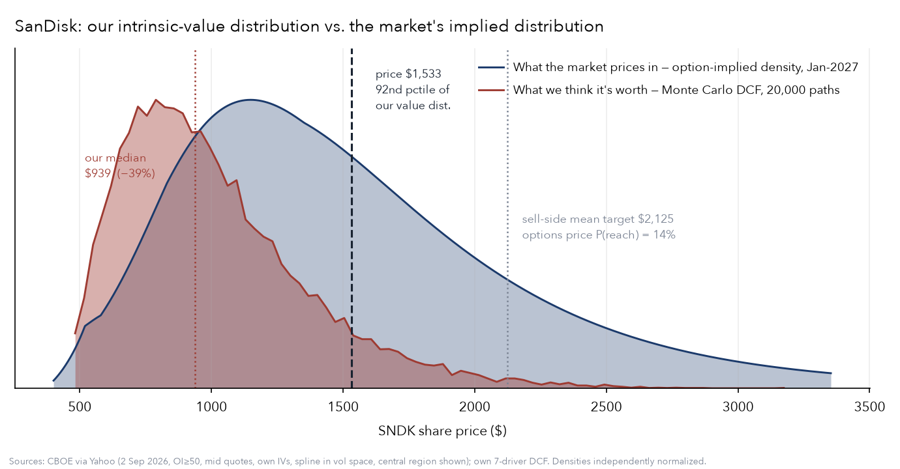
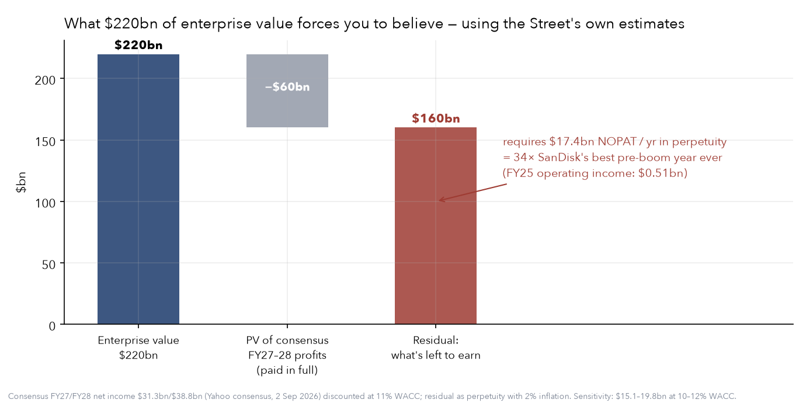
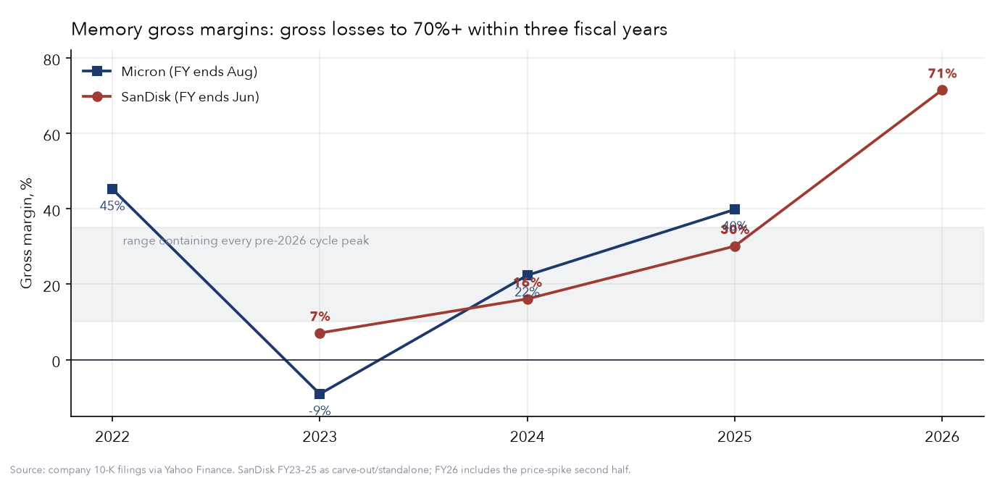

# The SanDisk Short — Full Case & Deck Plan

**Oxford Alpha Fund · Varsity Pitch Competition 2026 · Stock Selection & Deck Plan**

| | |
|---|---|
| Recommendation | **SHORT SanDisk (NASDAQ: SNDK)** |
| Price at analysis | **$1,533** (2 Sep 2026) · Market cap $224.5bn · EV $219.9bn |
| 12-month base target | **$960 (−37%)** · scenario range $650–$2,100 |
| Expected short return | **+23%** probability-weighted · risk/reward ≈ **3.5 : 1** |
| Headline | Today's price sits at the **92nd percentile** of our intrinsic-value distribution |
| Engine status | 13/13 verification tests passing (`analysis/tests/`) |

**The one-liner:** *The market has repriced a commodity cyclical as a structural monopoly — and even paying the Street's own boom estimates in full, the residual price demands 34× the best year this business has ever had, forever.*

---

## 1. How the funnel decided

Three candidates went into the week-1 screen. The reverse DCF killed two of them — including one we liked.

| Candidate | Reverse-DCF verdict | Decision |
|---|---|---|
| **Long Diageo (DGE.L)** | Price implies **+2.8%/yr** sales growth for 10 yrs (WACC 8%, 27% margin) — vs. actual growth of **−1.7%**. The market is *not* pricing terminal decline; it already prices recovery. Sell-side is Buy-rated at +18%. The expectations gap runs *against* the long. | Killed. A value trap dressed as a contrarian idea. No listed options either — our differentiator exhibit dies. |
| **Long Humana (HUM)** | Already +145% off the March lows to 24× forward earnings. The recovery leg we wanted to buy has been bought. | Killed. Window closed. |
| **Short SanDisk (SNDK)** | Even paying full consensus for FY27–28, the residual EV demands **$17.4bn NOPAT per year in perpetuity — 34× the best pre-boom year ever**. Every exhibit fired. | **Selected.** |

Micron ran as a cross-check: its $1.04tn EV demands ~$99bn/yr perpetual NOPAT after consensus FY27–28 (actual FY25 net income: $8.5bn). The whole complex is priced for permanence — but MU carries the genuine HBM structural story and 45 covering analysts. SanDisk is the purest expression: **a commodity NAND maker with no HBM business, priced on the memory narrative**, 18 months into life as a public company. That is the sharper, more original, more defensible short — and this competition's history rewards exactly this archetype (shorts won 3 of the last 4 years, always idiosyncratic names).

## 2. The situation in five numbers

All from primary filings and market data pulled 2 Sep 2026.

1. **$50.65 → $2,354 → $1,533.** The 52-week round trip. +457% YTD; −34% off the June 25 peak; monthly closes since June: $2,274 → $1,215 → $1,567 → $1,533. Momentum broke in July.
2. **Gross margin 7% → 16% → 30% → 71.5%** across FY23–FY26 (quarterly: 23% → 78% in five quarters). Three years ago this company had *negative operating income*; FY26 operating income was $12.5bn. Nothing changed in the technology — the price of NAND changed.
3. **Consensus revenue: $20.2bn → $49.0bn → $57.8bn** (FY26→FY28), for a company that did $6–7bn for three straight years through FY25. The FY28 estimate range spans **$42.6bn to $83.4bn** — analysts are guessing, with the widest dispersion we measured anywhere.
4. **P/B 14.5×, EV/revenue 10.9×** — for a fab-heavy commodity manufacturer whose capital base sits in a JV. Reported capex is only ~$0.2bn/yr because the fabs live inside the **Kioxia joint venture** — the capital intensity (and the coming supply response) is off balance sheet.
5. **Short interest 8.2% of float, 0.46 days to cover, falling month-on-month**; 25Δ risk reversal is *positive* (calls richer than puts — lottery-ticket demand, not fear). The short is uncrowded. This is not a squeeze setup; it is a consensus long.

## 3. Three thesis pillars

Each pillar is a quantified variant view: what the market believes, what we can show, and the number that carries it.

### Pillar 1 — You are paying for the boom twice

*Market believes:* forward P/E of 5.8× means the stock is cheap even if the cycle fades.

*We can show:* the "cheapness" is an illusion of peak earnings. Grant the Street its entire boom — consensus net income of $31.3bn (FY27) and $38.8bn (FY28), paid in full at an 11% discount rate, is worth $60bn of PV. The remaining **$160bn of enterprise value requires $17.4bn of NOPAT every year in perpetuity from FY29 onward** ($15.1–19.8bn across a 10–12% WACC band). SanDisk's best year before this boom earned $0.51bn. The market is not pricing two great years; it is pricing a permanently transformed industry — *after* pricing the two great years separately.

Equivalent framing: at consensus revenue then +5%/yr, the price implies a **constant 35.9% EBITA margin for a decade plus terminal** — above every pre-2026 cycle *peak* in NAND history (long-run average ~10–15%, prior peaks 25–35%).

### Pillar 2 — Price-led margins mean-revert, and the supply response is already funded

*Market believes:* AI storage demand made memory structurally scarce; "sold out through 2027."

*We can show:* revenue tripled in a year with flat unit economics — this is a *price* spike against temporarily fixed supply, the textbook precondition for a capacity response. NAND supply is elastic on a 12–18 month lag; the industry's five players all announced major capex expansions in 2026, and the hyperscaler buying pattern (inventory pre-building against shortage) is the classic bullwhip that turns into a demand air-pocket exactly when new supply lands. Every prior peak in the data — Micron's 45% GM in FY22 — was followed by gross *losses* within 24 months (MU FY23: −9%). Crucially, **NAND is not HBM**: no sole-sourcing, no CoWoS packaging bottleneck, no qualification moat. The market is pricing the whole "memory" complex on economics that only DRAM/HBM possesses.

### Pillar 3 — The revision machine will reverse

*Market believes:* relentless upward estimate revisions (FY28 EPS consensus +45% in 90 days) confirm fundamental strength.

*We can show:* the revisions are the same signal as the stock — analysts marking models to spot NAND prices. That machine runs in reverse the month contract pricing rolls over: a 6× "cheap" forward P/E doubles overnight when E halves, and the $42.6–83.4bn FY28 revenue dispersion collapses toward the low end. Meanwhile the options market already dissents from the sell-side: it prices just a **14% probability of reaching the $2,125 mean analyst target** by January, and a **31% probability the stock is below $1,000**.

### Why does this mispricing exist? (the judges' favorite question)

- **An 18-month-old spin-off.** SNDK listed in Feb 2025; there is no institutional memory of this asset as a public company. Coverage was built during the boom and is anchored to spot prices.
- **Narrative contagion.** "Memory supercycle" is priced as one trade; NAND inherits HBM's scarcity premium without HBM's economics.
- **Flow ownership.** Index inclusion after a 30× cap increase, plus visible retail lottery demand (positive call skew) — holders who own it because it went up.
- **Reflexive estimates.** "Consensus supports the price" — but consensus is derived from the same spot prices as the price itself.

## 4. What the models say

One tested engine, four independent reads. Charts in [`analysis/outputs/`](../analysis/outputs/).

| Model | Headline result | Method note |
|---|---|---|
| Reverse DCF (7-driver Rappaport) | Residual EV after consensus boom = **$17.4bn/yr perpetual NOPAT = 34×** best pre-boom year; implied constant margin **35.9%** vs. 10–15% NAND long-run | Uses the Street's own FY27–28 estimates; sensitivity $15.1–19.8bn across WACC 10–12% |
| Margin-fade scenario DCF | Mid-cycle EBITA 35% → $1,566 (+2%) · 25% → $1,161 (−24%) · 15% → $756 (−51%) · 10% → $554 (−64%) | Consensus revenue held; 3-yr fade from 62%; the +2% ceiling *is* the asymmetry argument |
| Monte Carlo DCF (20,000 paths) | Median intrinsic **$939 (−39%)**; p5–p95 $572–$1,696; **P(worth > price) = 8.5%**; price at 92nd percentile | Growth & margin drawn jointly (ρ=0.7, Cholesky); WACC triangular 10–13%; Damodaran's probabilistic framework |
| Breeden–Litzenberger option-implied density (Jan-27, most liquid expiry: 193k OI) | ATM IV 74% · P(above today's price) 36–42% · **P(reach mean sell-side target) 14%** · P(<$1,000) 31% · P(> old high) 9% | 204 quotes, OI≥50, mid prices, own IVs, spline in vol space; renormalized central region; call-spread digital cross-check agrees within ~6pts; Mar-27 expiry confirms |
| Factor regression (vs SMH, Newey-West) | Beta 1.71, R² only 42%, **80% annualized idiosyncratic vol** | The thesis is majority-idio — a stock bet, not a sector bet; hedge leg still recommended (§6) |
| Positioning | SI 8.2% float, DTC 0.46, shorts *shrinking*; +1.2% 25Δ RR (calls over puts) | Uncrowded short, cheap borrow, no squeeze fuel; FINRA data ~2wks stale, labeled as such |

**The centerpiece slide:** our Monte Carlo intrinsic-value distribution (median $939) overlaid on the option-implied density (mode ~$1,150, fat right tail) on one price axis, with the $1,533 price line and the $2,125 sell-side target marked at its 14% implied probability. One chart carries the entire pitch: *our distribution, the market's distribution, and the price standing above both.* Rendered: [`centerpiece_mc_vs_market.png`](../analysis/outputs/centerpiece_mc_vs_market.png).

## 5. Valuation & scenarios

Probability-weighted, with per-scenario driver assumptions stated — the format both 2025 finalist decks used, upgraded with distributions.

| Scenario | Weight | Key assumptions | Target | Short return |
|---|---|---|---|---|
| **Base — normalization** | 55% | NAND contract prices roll over H1-27 as 2026 capex lands; revenue holds near consensus then fades; mid-cycle EBITA ~20% | $960 | +37% |
| **Deep bust** | 20% | Bullwhip unwind: hyperscaler inventory digestion + new supply; EBITA 10–15% (historical mid-cycle) | $650 | +58% |
| **Extended boom (against us)** | 25% | AI storage demand outruns supply into 2028; margins hold ≥35%; stock re-rates toward consensus target | $2,100 | −37% |

**Expected short return ≈ +23%** over 6–12 months; risk/reward ≈ 3.5:1. No dividend to pay, borrow cheap (SI 8.2%, to be confirmed on iBorrowDesk and quoted as indicative). Note the honest structure of the bet: our *fundamental* ceiling (35% margins forever) is only ≈ today's price — the against-us scenario requires continued *re-rating beyond* any margin history, which is exactly what makes the asymmetry credible under questioning.

## 6. Event path & trade construction

Dated hard catalysts, staged entry, and a hedge that isolates the idio bet — pod-style.

| When | Event | What we watch |
|---|---|---|
| ~22–24 Sep 2026 | **Micron FY26 results + FY27 Q1 guide** | First crack test for the complex, before our submission. NAND bit-growth guidance, inventory commentary, any capex acceleration (bearish for pricing later even if the print beats). |
| Monthly | **NAND contract-price prints (TrendForce/DRAMeXchange)** | The thesis's marginal datapoint. First sequential decline in contract pricing = the revision machine's reversal trigger. We collect and chart these from public summaries. |
| Late Oct 2026 | **Hyperscaler Q3 earnings (MSFT, GOOGL, AMZN, META)** | 2027 capex guidance framing + inventory-days build on their balance sheets (we compute from 10-Qs). |
| ~Early Nov 2026 | **SanDisk FQ1-27 earnings** | Inside our holding window. LTA coverage disclosures, gross-margin guide, JV capacity commentary. |
| Dec 2026 – Jan 2027 | **Samsung / SK Hynix 2027 capex budgets; Kioxia disclosures** | The supply response gets a number. Kioxia's listed results (285A.T) show JV economics directly. |
| H1 2027 | **New NAND capacity lands** | 2026-announced fabs/conversions reach output; pricing rolls; estimates follow. Exit target window. |

**Construction:** stage the entry — half position at pitch, half on the first negative NAND contract print or a soft MU guide. Hedge the ~42% of variance that is sector beta with a partial long SMH (or long MU) leg, framing the trade as "short NAND normalization, not short AI." With 74% ATM IV, express tail-risk discipline via a small OTM call position rather than a hard stop (survives squeezes without covering at the top); size such that the against-us scenario costs ≤ the risk budget.

### Kill criteria (pre-committed)

- NAND contract prices still rising sequentially by Jan-2027 → thesis timing is wrong; cover half, reassess.
- Hyperscaler 2027 capex guides accelerate meaningfully above 2026's ~$775–800bn with storage-specific commitments → demand leg stronger than modeled.
- SNDK guides FY27-H2 gross margin >60% with disclosed LTA coverage >70% of bits → repricing deferred beyond our horizon.

## 7. The 10-slide deck

Every slide has its number and its exhibit. Structure follows the winning skeleton: conclusion first, consensus steel-manned, variant view quantified, catalysts dated.

| # | Slide | Content | Exhibit |
|---|---|---|---|
| S1 | **Recommendation — Short SanDisk (SNDK), $1,533** | 12-mo base target $960 (−37%), range $650–$2,100, expected +23%, R/R 3.5:1. The one-liner: "Even paying the Street's own boom forecasts in full, today's price requires 34× the best year this business ever had — forever." Three pillars as roadmap. | Verdict stat bar + mini price chart ($50→$2,354→$1,533) |
| S2 | **What SanDisk is — and is not** | NAND flash pure-play, spun from Western Digital Feb-2025; fabs held in the Kioxia JV (capex off balance sheet — reported capex $0.2bn/yr); revenue by end-market. IS NOT: an HBM/DRAM company. One annotated price chart tells the narrative arc. | Revenue mix + annotated 52-week chart |
| S3 | **Industry: NAND is not HBM** | Five-player oligopoly that has always been an oligopoly — including through every bust. Supply elastic on 12–18mo lag; no sole-sourcing, no packaging bottleneck, no qualification moat. Margin-cycle chart: gross losses to 70%+ in three fiscal years, every prior peak (shaded 10–35% band) followed by collapse within 24 months. | `margin_cycle.png` + capex/supply timeline |
| S4 | **What's priced in — measured, not asserted** | The signature slide. Waterfall: $220bn EV − $60bn PV of full consensus boom = $160bn residual = $17.4bn/yr forever = 34× best pre-boom year. Implied constant margin 35.9% vs. every historical peak. Consensus FY28 revenue dispersion $43–83bn. Steelman the bull case honestly here — then the number does the attacking. | `priced_in_waterfall.png` + implied-margin locus |
| S5 | **Pillar 1 — Peak-multiple illusion** | "5.8× forward P/E" decomposed: what happens to the multiple when E normalizes; the FY23–26 margin path (7%→71%) shows E is price, not units; cyclicals look cheapest at the top (every prior cycle's forward P/E trough coincided with the earnings peak). | GM path + P/E-vs-cycle panel |
| S6 | **Pillar 2 — The supply response is funded and dated** | 2026 capex announcements across all five players; Kioxia JV expansion; hyperscaler inventory bullwhip evidence (inventory days from 10-Qs); LTA renegotiation precedents from prior busts (2019, 2023). Demand is real — that is why supply is coming. | Capacity-additions timeline + inventory-days chart (to build) |
| S7 | **Pillar 3 — The revision machine reverses** | FY28 EPS consensus +45% in 90 days, charted against NAND spot — the same line twice. What consensus did at the last two cycle tops. The options market already dissents: P(reach sell-side mean target) = 14%. | Estimate-revision momentum vs. NAND price overlay |
| S8 | **Valuation — distributions, not points** | THE centerpiece: Monte Carlo intrinsic distribution vs. option-implied density on one axis, price at our 92nd percentile. Scenario table with weights, per-scenario drivers, +23% EV, 3.5:1. One slide; the machinery lives in appendix. | `centerpiece_mc_vs_market.png` + scenario table |
| S9 | **Event path — how we get paid** | The dated timeline (MU print → monthly NAND prints → hyperscaler capex → SNDK print → 2027 budgets → H1-27 capacity landing), staged entry, hedge construction (short SNDK / partial long SMH: "short NAND normalization, not short AI"), per-event thesis checkpoints. | Catalyst timeline with entry/exit markers |
| S10 | **Risks, kill criteria & asymmetry** | Three specific risks with mitigants: (1) demand outruns supply into 2028 — mitigated by granting consensus FY27–28 in full; (2) squeeze/momentum — mitigated by low SI, staged entry, call-protected sizing; (3) LTAs defer repricing — historical renegotiation precedent + kill criterion attached. Close on asymmetry: fundamental ceiling ≈ price, base −37%. | Risk/mitigant/kill table + asymmetry bar |

### Appendix (5 slides — built for Q&A)

| # | Slide | Content |
|---|---|---|
| A1 | **Reverse-DCF mechanics** | 7-driver structure, WACC build, full sensitivity grids (WACC × terminal assumptions), the $15.1–19.8bn perpetual-NOPAT band. |
| A2 | **Monte Carlo methodology** | Input distributions anchored to filing history, correlation matrix (ρ=0.7 growth↔margin with economic justification), rejection rules, tornado chart of variance drivers. |
| A3 | **Option-implied density methodology** | Filtering (OI≥50, mid quotes, own IVs), vol-space spline, validation (integral, call-spread digital cross-check), and the pre-written risk-neutral vs. real-world answer. |
| A4 | **Factor decomposition & positioning** | Beta 1.71/R² 42% vs SMH (Newey-West), 80% idio vol, rolling beta; short interest, borrow (indicative), skew history. |
| A5 | **Kioxia JV accounting & LTA analysis** | Equity-method mechanics, JV capex vs. reported capex, what the LTAs actually commit, bust-era renegotiation precedents. |

### Q&A — the six questions that decide the final

1. **"Isn't this just shorting the AI trade?"** No — we grant the demand story and the full consensus boom. The bet is that NAND's supply elasticity reasserts itself after the boom the price already pays for twice. Hedged long SMH, the position is short NAND normalization, not short AI.
2. **"Risk-neutral or real-world?"** Risk-neutral — it embeds risk premia, which is exactly why we use it as *what the market prices*, never as our forecast.
3. **"Why SNDK and not MU/WDC?"** MU has genuine HBM economics and 45 analysts; WDC is now an HDD company. SNDK is the purest NAND exposure, the most extreme repricing (+457% YTD), and the thinnest institutional memory (spun Feb-25).
4. **"You're fighting rising estimates."** Correct, and we say so — which is why entry is staged on the first negative contract print, the catalyst that has reversed every prior memory revision cycle.
5. **"What if the LTAs hold pricing?"** Kill criterion pre-committed; and LTAs were renegotiated in both prior busts. We'll have the JV/LTA appendix slide cold.
6. **"What would make you wrong?"** Structural, not cyclical, NAND scarcity: hyperscaler storage commitments outrunning announced 2027 capacity. We name the datapoints that would prove it and the dates they arrive.

## 8. What was built & what remains

**Built and verified** (in [`analysis/`](../analysis/)): the 7-driver DCF engine with reverse solvers; Monte Carlo with correlated draws; Breeden–Litzenberger pipeline with validation; factor regression; data pullers for fundamentals, estimates, and option chains; **13 verification tests, all passing** (closed-form perpetuity match, solver round-trips, lognormal recovery on flat smile, MC degeneracy check, put-call parity). Charts in [`analysis/outputs/`](../analysis/outputs/).

**Team to-do before submission:**

- [ ] Confirm the submission deadline (varsitypitchcompetition2026@gmail.com) — everything schedules off it.
- [ ] Start collecting monthly NAND contract prices (TrendForce public summaries) and hyperscaler inventory days from 10-Qs; begin Wayback captures of SNDK IR and enterprise-SSD pricing pages.
- [ ] Retail SSD price series (e.g. PCPartPicker history on standard 1TB/2TB drives) — consumer price pass-through as demand-destruction evidence, a chart nobody else will bring.
- [ ] Read SNDK's FY26 10-K cold: LTA disclosures, JV commitments, customer concentration. Read the Kioxia (285A.T) results deck.
- [ ] Verify borrow cost on iBorrowDesk (quote as indicative); refresh short interest at each FINRA print.
- [ ] Mirror the Python engine in an Excel workbook (the optional-but-graded financial model), number-for-number.
- [ ] Mock Q&A twice weekly from the six questions above; the bear case is ours to know better than the bulls.

---

*Engine: `analysis/quant/` (13/13 tests). Data pulled 2 Sep 2026 from company filings via Yahoo Finance, CBOE option quotes (Jan/Mar-27 expiries), FINRA short interest, ^IRX risk-free. Consensus: Yahoo/LSEG aggregation. Companion memo: [PLAYBOOK.md](PLAYBOOK.md) (strategy & methodology). Prices move — refresh every exhibit the week of submission and again before finals.*
